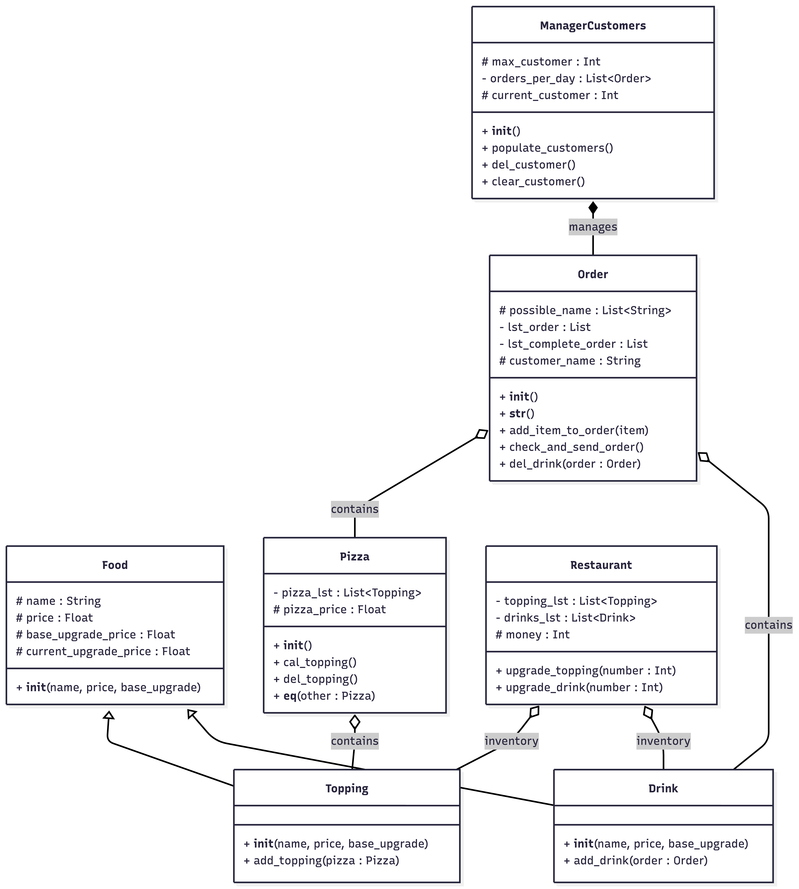

# Project Description

## 1. Project Overview

- **Project Name: Little Pizza House**  
- **Brief Description:**  
    Little Pizza House, a fun game where you get to be the chef of your own restaurant. Your daily job is to serve customers by cooking exactly what they order. You will need to bake pizzas with the right ingredients and prepare the correct drinks to match. You gain money whenever you finish a customer's order perfectly.

    At the end of each day, you can spend the money you made to improve your shop. You can buy upgrades, like increasing the value of pizza toppings and better drinks. Upgrading your menu means your customers will happily pay more, which helps you earn even more money as your little pizza house grows.

- **Problem Statement:**

    PC gamers who love cooking simulators often struggle to find dedicated pizza-making games. When they do play restaurant games, they are usually forced to compete against a fast-ticking timer. This constant rush takes away the joy of cooking and managing a shop. Players are missing a cozy, relaxing game where they can take their time preparing orders, upgrading their ingredients, and growing their business without the stress of a countdown.

- **Target Users:**  
  People who love cooking simulator.

- **Key Features:**  
  - Create new pizza 
  - Add topping
  - Add drink
  - Upgrade topping
  - Upgrade drink
  - Check in-game statistic

- **Screenshots:**

- **Proposal:**
[LIttlePizzaHouse_Proposal](/LIttlePizzaHouse_Proposal.pdf)
---

## 2. Concept

### 2.1 Background
Explain the foundation of the project.
The inspiration for Little Pizza House came from my own gaming experiences. I used to spend hours on my iPad playing Cooking Diary, managing a busy mobile burger shop. However, as I started using my computer more often, I found myself missing that fun, engaging gameplay. I wanted to play my favorite game on   my PC, so I decided to build my own version. Little Pizza House brings the joy of those classic mobile cooking games to the computer, but we have pizzas instead of burger.

### 2.2 Objectives

### **Objectives of the Project**
* **Develop a PC-Friendly Interface:** To build a cooking simulator specifically designed for a computer, using comfortable mouse controls (like clicking) rather than mobile touchscreens.
* **Create a Core Gameplay Loop:** To program a system where the player can receive randomized customer orders, select the correct ingredients to bake a pizza, prepare a drink, and successfully serve the meal.
* **Implement a Working Economy:** To build a shop system where players earn virtual money for correct orders and can spend that money at the end of the day to buy toppings and drink upgrades.

### **What the System Aims to Achieve**
* **Deliver a Stress-Free Experience:** To provide a relaxing "cozy gaming" environment by removing the traditional fast-ticking timers found in most cooking simulators, allowing players to cook at their own pace.
* **Provide Satisfying Progression:** To give players a sense of achievement by letting them watch their small pizzeria grow into a more profitable business as they upgrade their menu and earn higher incomes.
* **Fill a Market Gap:** To bring the addictive, fun gameplay style of mobile restaurant games (like *Cooking Diary*) to our computer, satisfying players who want to play management games on their computers.

---

## 3. UML Class Diagram

[Download or View UML](/UML/uml.pdf)

---

## 4. Object-Oriented Programming Implementation

- **Food:** A base class representing a generic menu item. It stores shared attributes such as the item's name, current price, base upgrade price, and current upgrade price.
- **Topping:** Inherits from Food. Represents a specific ingredient for a pizza and includes functionality to add itself directly to a Pizza object's topping list.
- **Drink:** Inherits from Food. Represents a beverage and includes functionality to add itself directly to a customer's Order object.
- **Pizza:** Represents a customizable pizza that stores a collection of Topping objects. It is responsible for calculating its own total price based on its toppings and includes logic to compare itself to other pizzas.
- **Order:** Represents a specific customer's transaction. It is responsible for generating a random customer name, storing the items they want to buy pizzas and drinks, and managing the status of the completed order.
- **ManagerCustomers:** Acts as a controller for the daily flow of customers. It initializes a random number of daily customers, stores them as a queue of Order objects, and handles removing or clearing customers as they are processed.
- **Restaurant:** A central management class that holds the static inventory of available toppings and drinks. It tracks the restaurant's total money and contains the business logic for purchasing upgrades to increase the price and value of specific menu items.

---

## 5. Statistical Data

### 5.1 Data Recording Method
All in-game data will be continuously recorded and saved into a CSV file. To ensure the data is perfectly organized for the final analysis report, each row in the CSV will represent a single completed customer order. The file will be structured using specific column headers; such as Day, OrderID, ItemPrice, ToppingsUsed, DrinkType, and OrderAccuracy, Time Taken allowing the game to efficiently track daily earnings, identify the most popular menu items, and calculate the player's overall accuracy.

### 5.2 Data Features
| Feature | Why it is good to have this data? What can it be used for | How will you obtain 100 values of this feature data? | Which variable (and which class will you collect this from)? | How will you display this feature data (via summarization statistics or via graph)? |
| :--- | :--- | :--- | :--- | :--- |
| Feature 1: Amount of Money per Menu | Record Amount of Money per Menu: Approximately how much 1 menu item sells for. | By collecting 100 orders | Variable ItemPrice collected from the Order object and Food class (CalPrize()). | Scatter plot |
| Feature 2: Time taken each Order | Record the time taken since the customer start give out order until the order is done | By collecting 100 orders | Variable Time Taken collected from the Order object. | Histogram |
| Feature 3: Number of Toppings Used | Record Number of Toppings Used: Which type of topping is ordered most frequently by customers. | By collecting 100 orders | Variable ToppingsUsed collected from the Order object and Pizza/Topping classes. | Table |
| Feature 4: Order Delivery Accuracy | Record Order Delivery Accuracy: Checking whether the pizza or drink served by the player matches the specifications determined by the customer's order. | By collecting 100 orders | Variable OrderAccuracy collected from the Order object using CheckOrder(). | Pie chart |
| Feature 5: Number of Drinks | Record Number of Drinks: Which type of drink is ordered most frequently by customers. | By collecting 100 orders | Variable Drink Type collected from the Order object and Drink class. | Bar graph |

---

## 6. Changed Proposed Features (Optional)
I have updated the data collection method from a daily-based approach to an order-based approach.
Because order-based approach is more elaborate than daily-based.

---

## 7. External Sources

Game music: https://pixabay.com/th/music/%e0%b9%80%e0%b8%95%e0%b8%99-lofi-chill-background-music-313055/\

Make new pizza sound: https://pixabay.com/sound-effects/film-special-effects-sharp-pop-328170/

Add topping1 sound: https://pixabay.com/sound-effects/film-special-effects-pop-cartoon-328167/

https://pixabay.com/sound-effects/musical-cuspofnewyears-snare-87974/

Add drink: https://pixabay.com/sound-effects/film-special-effects-opening-top-on-soda-can-230923/

Send order sound: https://pixabay.com/sound-effects/som-matricula-464025/

End day sound: https://pixabay.com/sound-effects/musical-fx-piano-surprise-497207/

Upgrade sound: https://pixabay.com/sound-effects/film-special-effects-bonus-points-190035/

Customer images: https://github.com/LylatierN/Cauldron_n_Coins.git

