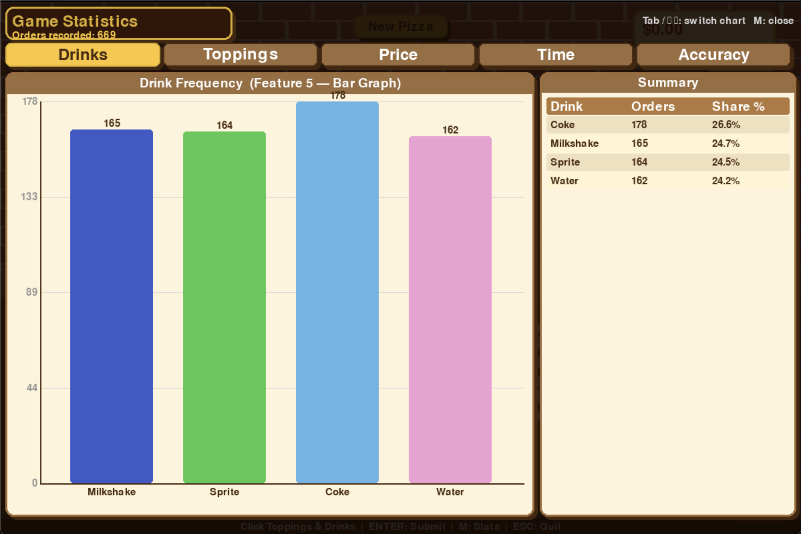
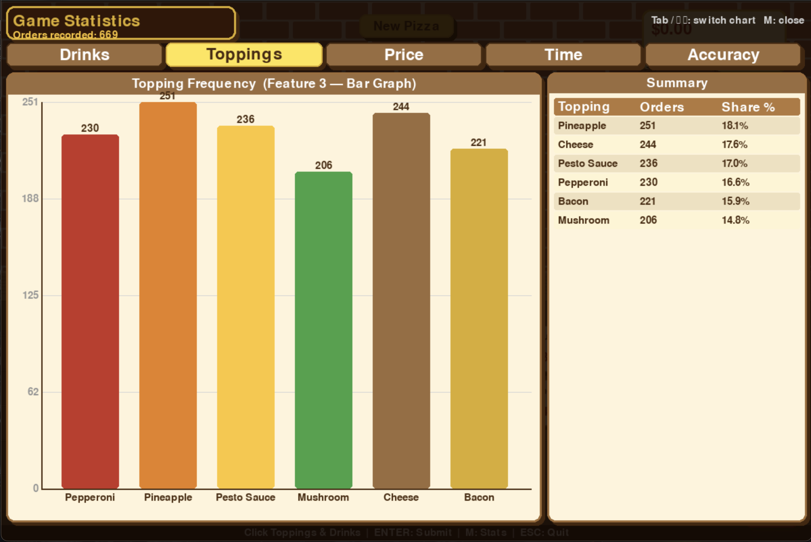
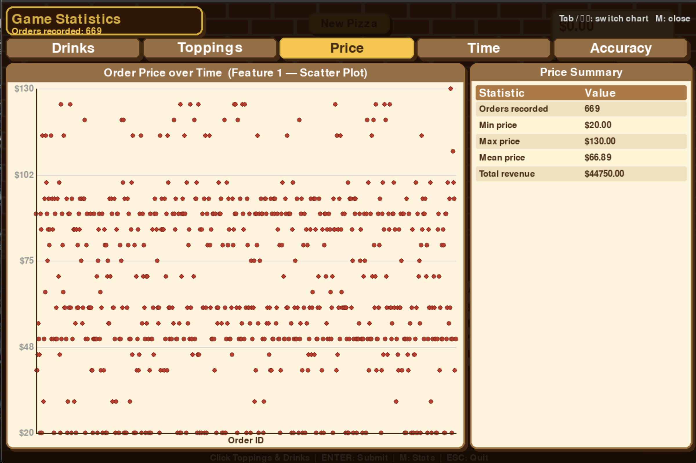
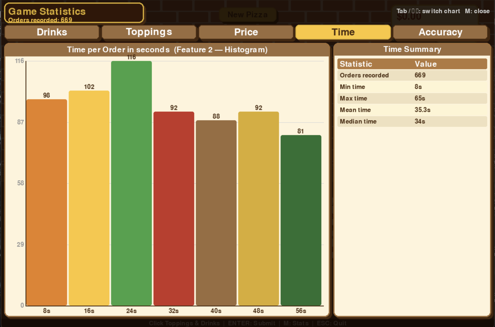
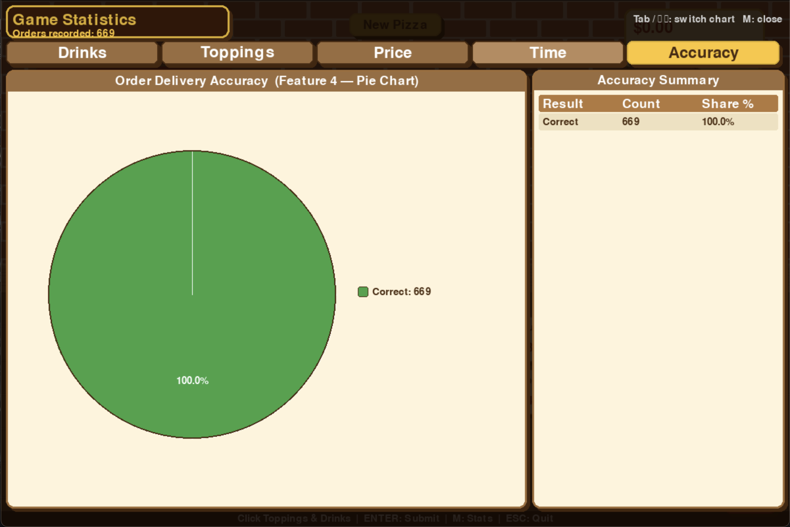

## Graph Type: Scatter plot
- **Data Collected:** Records the approximate amount of money each menu item sells for. This helps analyze the relationship between different menu items and the total money earned.  
- **Display:** The X-axis represents the Menu Item or Order ID, and the Y-axis represents the Amount of Money. (In your screenshot, the prices are distributed between $20.00 and $130.00).  

## Graph Type: Histogram
- **Data Collected:** Records the time taken from the moment a customer places an order until that order is completed. It shows the overall distribution of time spent on customer orders.  
- **Display:** The X-axis shows the time taken in seconds, and the Y-axis shows the frequency of orders completed within those timeframes.  

## Graph Type: Bar graph
- **Data Collected:** Records the number of toppings used to determine which topping types are ordered most frequently by customers.  
- **Display:** The X-axis displays the Topping Types, and the Y-axis shows the frequency of how often they are sold.  

## Graph Type: Pie chart
- **Data Collected:** Checks whether the pizza or drink served by the player exactly matches the customer's specifications.  
- **Display:** Shows the proportion and percentage of accurate orders versus inaccurate orders. (As seen in your screenshot, the player has achieved a 100% correct delivery rate).

## Graph Type: Bar graph
- **Data Collected:** Records the number of drinks ordered to track which type of drink is the most popular among customers.  
- **Display:** The X-axis represents the Drink Types, and the Y-axis displays the frequency of those orders.